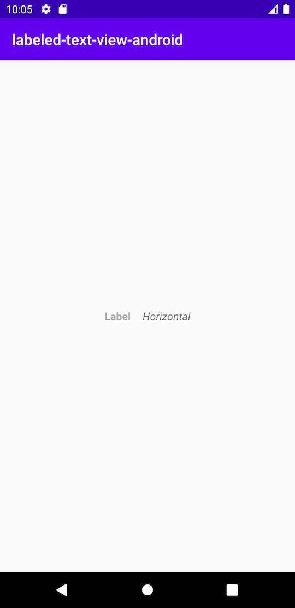

Labeled Text View
=================

[](https://jitpack.io/#WMariusz/labeled-text-view)

Simple TextView with label in LinearLayout



```xml
    <com.wmariusz.labeledtextview.LabeledTextView
        android:layout_width="wrap_content"
        android:layout_height="wrap_content"
        android:orientation="horizontal"
        android:text="Horizontal"
        android:textAppearance="@style/TextAppearance.LabelTextView.Text"
        app:labelText="Label"
        app:labelTextAppearance="@style/TextAppearance.LabelTextView.Label"
        app:textPadding="16dp" />
```

Download
--------

1. Add to root `build.gradle`
```groovy
    allprojects {
        repositories {
            ...
            maven { url 'https://jitpack.io' }
        }
    }
```

2. Add dependency
```groovy
    implementation 'com.github.WMariusz:labeled-text-view:0.0.1'
```
